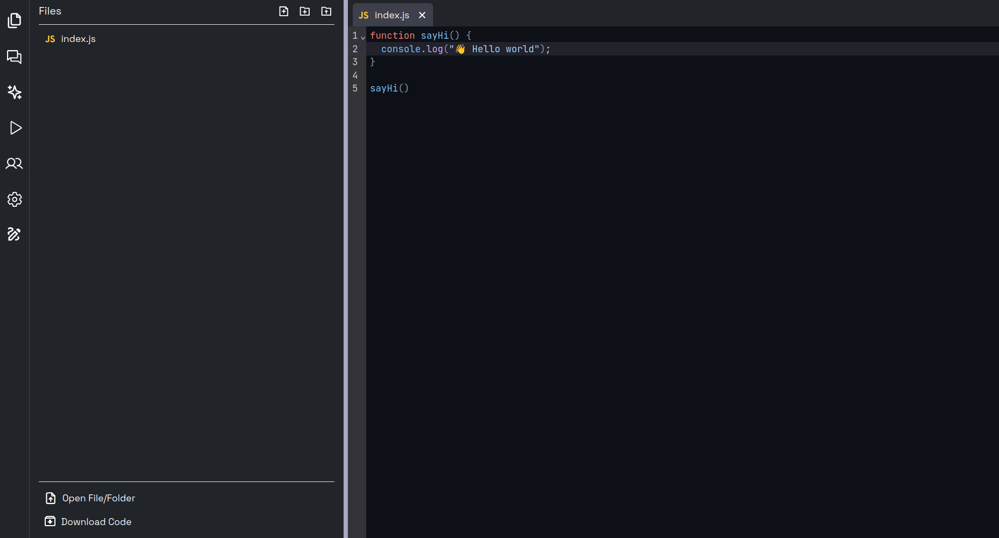
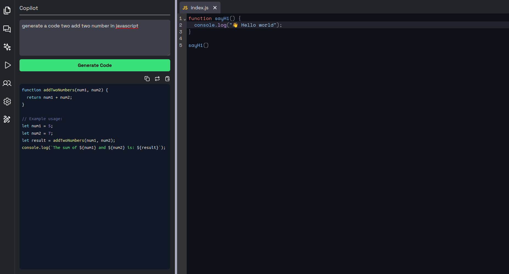
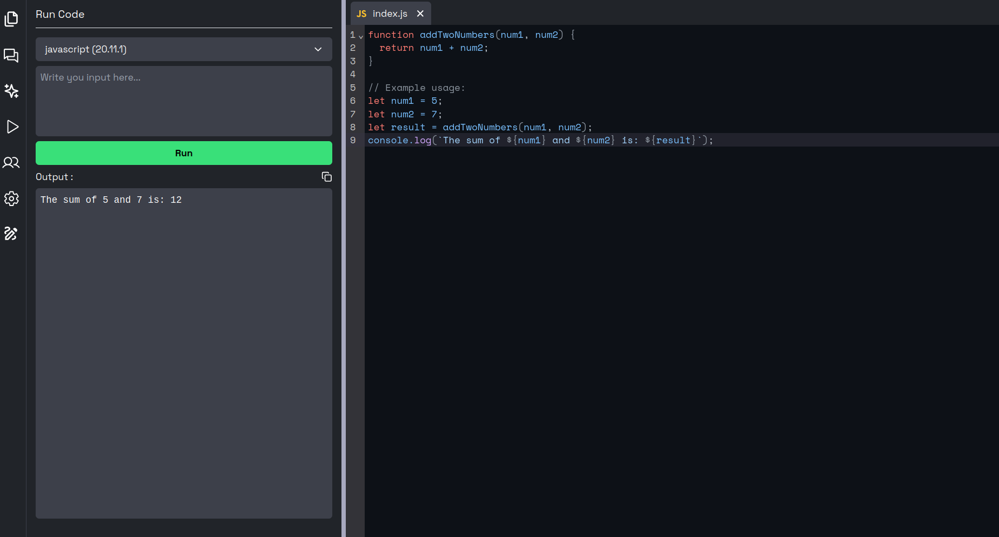
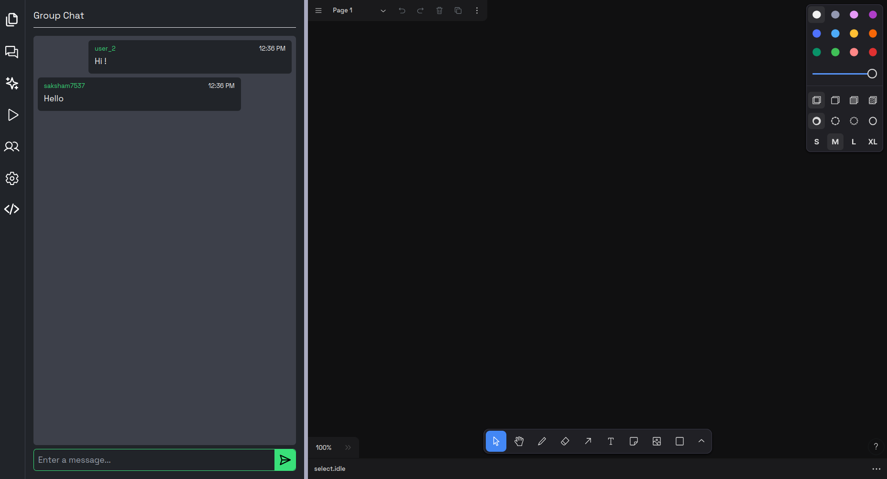
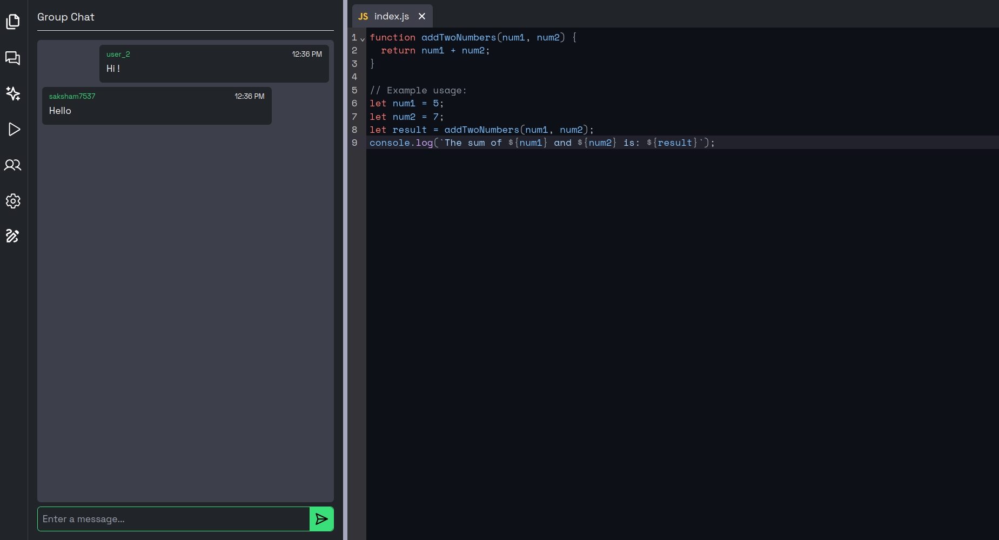

# CodeSync

### AI-Powered Collaborative Cloud IDE with Real-Time Code Execution

CodeSync is a browser-based collaborative development environment that combines a modern code editor, AI-assisted development workflows, real-time collaboration, visual whiteboarding, and secure multi-language code execution.

Designed to bring coding, ideation, and execution into a single workspace.

---

# Preview

<!-- Replace these placeholders with actual images -->

## Editor Workspace



---

## AI Code Generation



---

## Code Execution



---

## Whiteboard Workspace



---

## Real-Time Collaboration



---

# Features

## Collaborative Development Environment

* Real-time collaborative coding
* Shared workspace sessions
* Live synchronization across users
* Multi-user editing support
* Instant state updates

---

## Intelligent Code Editor

* Monaco Editor integration
* Syntax highlighting
* Multi-file editing
* File explorer
* File creation and management
* Folder hierarchy support
* Automatic language detection
* Fast editor rendering

---

## AI Development Assistant

Generate and improve code directly inside the workspace.

Capabilities:

* Generate code from prompts
* Explain code
* Debug assistance
* Improve existing implementations
* Accelerate development workflow

Example:

```text
Prompt:
Build a login page using React and Tailwind

Output:
Production-ready React component
```

---

## Code Execution Engine

Integrated a self-hosted execution system powered by Piston.

Features:

* Execute code directly from browser
* Multi-language runtime support
* Input (STDIN) support
* Output console
* Runtime error handling
* Sandboxed execution using Docker

Supported Languages:

* JavaScript
* Python
* C++
* Java
* Extensible runtime architecture

Execution Pipeline:

```text
Editor
   |
   v
Frontend State
   |
   v
Execution API
   |
   v
Piston Runtime
   |
   v
Docker Sandbox
   |
   v
Output Console
```

---

## Whiteboard + Code Workspace

Switch seamlessly between development and visual collaboration.

Modes:

### Code Mode

* Write and execute code

### Whiteboard Mode

* Draw ideas
* Create system designs
* Visualize workflows
* Plan architecture
* Explain algorithms

Built for brainstorming and collaborative problem solving.

---

## Architecture

```text
                     Client
                       |
         --------------------------------
         |                              |
         |                              |
      React                        Socket.IO
         |                              |
         ----------- Backend ------------
                        |
                   Execution Layer
                        |
                  Self Hosted Piston
                        |
                     Docker
```

---

# Tech Stack

## Frontend

* React.js
* TypeScript
* Tailwind CSS
* Monaco Editor
* Context API
* Axios

## Backend

* Node.js
* Express.js
* Socket.IO

## AI

* Generative AI APIs

## Infrastructure

* Docker
* Self-hosted Piston API

---

# Local Setup

Clone repository

```bash
git clone YOUR_REPOSITORY_URL
```

Install dependencies

```bash
npm install
```

Run application

```bash
npm run dev
```

---

# Setup Local Code Execution

Clone Piston

```bash
git clone https://github.com/engineer-man/piston.git
```

Run

```bash
docker compose up -d
```

Install runtimes

```bash
./piston ppman install node
./piston ppman install python
./piston ppman install gcc
```

Verify

```bash
curl localhost:2000/api/v2/runtimes
```

---

# Environment Variables

Create `.env`

```env
VITE_API_URL=
VITE_SOCKET_URL=
VITE_PISTON_URL=
AI_API_KEY=
```

---

# Future Enhancements

* Terminal integration
* GitHub repository import
* AI pair programming
* Deployment from editor
* Persistent collaborative sessions
* Workspace templates

---

# Resume Highlights

This project demonstrates:

* Full Stack Development
* Real-Time Systems
* WebSocket Communication
* AI Integration
* Cloud IDE Architecture
* Docker-based Runtime Isolation
* Scalable Frontend Architecture

---

## Author

Saksham Sethi
